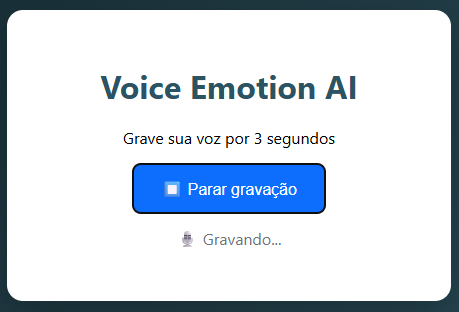
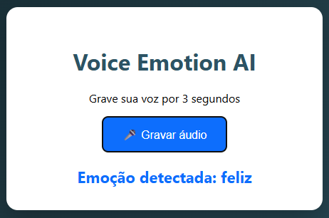

# 🎤 Reconhecimento de Emoções na Voz com SVM

Sistema de reconhecimento de emoções na voz utilizando Machine Learning baseado em `SVM (Support Vector Machine)`, com pipeline completo de engenharia de atributos, treinamento estatístico e API de inferência em tempo real.

Este projeto tem caráter acadêmico, experimental e científico para estudos em Inteligência Artificial aplicada a áudio e emoções.

---

## 🧠 O que é SVM?

**SVM (Support Vector Machine)** é um algoritmo de Machine Learning supervisionado utilizado para classificação e regressão.

Ele trabalha encontrando um hiperplano ótimo que separa as classes com a maior margem possível, tornando o modelo extremamente robusto a ruídos e overfitting.

No contexto deste projeto, o SVM é utilizado para aprender os padrões estatísticos das características da voz humana associadas a emoções diferentes.

---

## 📦 Base de Dados

O projeto utiliza a base CREMA-D (Crowd-Sourced Emotional Multimodal Actors Dataset), disponível em:

> https://www.kaggle.com/datasets/ejlok1/cremad


A CREMA-D contém milhares de amostras de voz gravadas por diferentes atores, expressando emoções reais de forma padronizada.

Cada arquivo de áudio possui marcações que identificam a emoção expressa, permitindo treinamento supervisionado.

---

## ⚙️ Como acontece o treinamento de Machine Learning

O pipeline do projeto segue as seguintes etapas:

1. Leitura dos áudios WAV
2. Remoção de silêncio (filtro RMS)
3. Extração de atributos acústicos:
    - MFCC (Mel Frequency Cepstral Coefficients)
    - Delta-MFCC (variação temporal dos MFCC)
    - Zero Crossing Rate (ZCR)
    - Root Mean Square Energy (RMS)
4. Normalização estatística com StandardScaler
5. Treinamento do classificador SVM
6. Salvamento do modelo treinado
7. Disponibilização via API REST

Esse processo garante que o modelo aprenda padrões reais da voz, e não apenas volume ou ruído.

---

## 🎭 Emoções Reconhecidas

O modelo é capaz de reconhecer as seguintes emoções:

| Emoção | Descrição |
|---------|-----------------------------------|
| feliz | Voz alegre, positiva |
| triste | Voz com tom baixo e melancólico |
| irritado| Voz agressiva ou tensa |
| neutro | Voz neutra, sem emoção aparente |

---

## 🌐 API de Inferência

O projeto possui uma API REST desenvolvida em FastAPI, responsável por:

- Receber áudios enviados via POST
- Extrair automaticamente as características acústicas
- Aplicar o modelo SVM
- Retornar:
 - Emoção prevista
 - Grau de confiança da predição

### Endpoint principal

> POST /predict

Retorno:
```
{
 "emotion": "feliz",
 "confidence": 0.91
}
```
---

## 🖥️ Interface Web

O projeto possui uma interface web que permite:

- Gravar áudio pelo microfone
- Enviar para a API
- Visualizar a emoção detectada em tempo real

### Prints da interface

## 🖥 Interface (vazia) 

 

--- 

## 🖥 Interface (com resultado) 



---

## ▶️ Como rodar o projeto

### 1. Executar o pipeline de Machine Learning

```
python backend/main.py
```
Esse comando irá:
- Extrair features
- Treinar o modelo
- Gerar o modelo final em `backend/model/`

### 2. Iniciar a API

```
cd backend

uvicorn api:app --host 127.0.0.1 --port 8000
```

A API ficará disponível em:

```
http://127.0.0.1:8000/docs
```

### 3. Abrir a interface

Abra o arquivo `frontend/index.html` diretamente no navegador.

---

## 📌 Considerações

Este projeto é um mini-laboratório de pesquisa em reconhecimento emocional por voz, demonstrando:

- Engenharia de atributos acústicos
- Classificação estatística com SVM
- API de inferência em tempo real
- Interface web funcional
